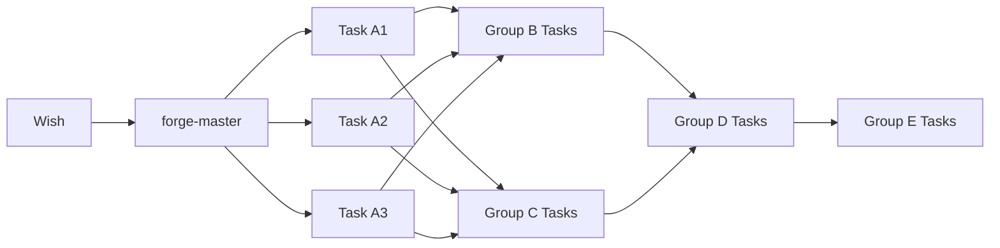
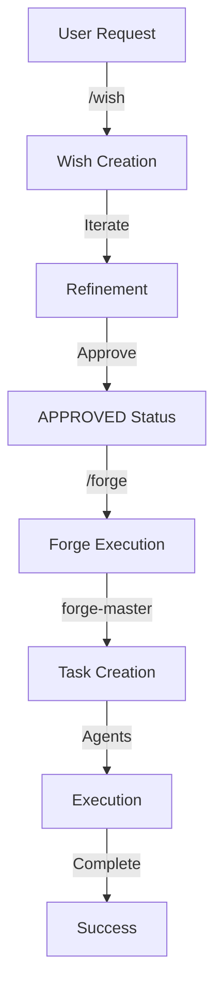

# /forge - Execute Wish via Forge Task Creation

---
description: 🎯 Transform approved wishes into optimized Forge tasks using the Advanced Prompting Framework, then execute them through the forge-master agent
---

## 🚀 FORGE EXECUTION WORKFLOW

When a user invokes `/forge`, you orchestrate the transformation of a wish specification into actionable Forge tasks through the specialized forge-master agent.

### Phase 1: Wish Validation

<context_gathering>
Goal: Verify wish is ready for execution

Method:
- Check wish file exists and is complete
- Validate wish status is APPROVED
- Ensure all task groups are defined
- Confirm success criteria are measurable

Early stop criteria:
- Wish file found and readable
- Status confirmed as APPROVED
- Task decomposition complete
</context_gathering>

**1.1 Pre-Flight Checklist**
```
[VALIDATION]
✅ Wish file exists at specified path
✅ Wish status = APPROVED
✅ Task groups A-E defined
✅ Dependencies mapped
✅ Success criteria measurable
```

**1.2 Extract Task Groups**
Parse the wish for:
- Group dependencies
- Parallel execution opportunities  
- File creation/modification paths
- Success validation steps

### Phase 2: Forge Task Generation

**2.1 Trigger forge-master Agent**

<task_breakdown>
1. [Preparation] Ready the wish for agent consumption
   - Format wish path with @ prefix for auto-loading
   - Identify task complexity levels
   - Map to reasoning_effort settings

2. [Invocation] Call forge-master with structured prompt
   - Pass wish specification
   - Include project context
   - Set appropriate complexity flags

3. [Verification] Confirm task creation
   - Validate all groups processed
   - Check task IDs generated
   - Verify branch names created
</task_breakdown>

**2.2 Agent Invocation Template**

```markdown
/agent forge-master

## Mission
Transform the approved wish into Forge tasks with Advanced Prompting Framework optimization.

## Context
@{wish-file-path}
@.claude/commands/prompt.md [framework reference]

## Project Configuration
- Project ID: 9ac59f5a-2d01-4800-83cd-491f638d2f38
- Repository: automagik-forge

## Task Creation Instructions

<persistence>
- Create all task groups from the wish
- Never skip dependencies or success criteria
- Document every framework pattern applied
- Complete all tasks before yielding
</persistence>

### Group Processing Order

For each task group in the wish (A through E):

1. **Analyze Complexity**
   - Simple fix: minimal/think
   - Feature: medium/think hard  
   - Architecture: high/think harder
   - Multi-step: max/ultrathink

2. **Apply Framework Patterns**

For Group A (Foundation):
<context_gathering>
- Search depth: low (files are specified)
- Parallelize all A tasks
- reasoning_effort: {appropriate level}
</context_gathering>

For Group B-C (Core/UI):
<task_breakdown>
1. [Discovery] Components from A
2. [Implementation] Create services/components
3. [Verification] Test endpoints/rendering
</task_breakdown>

For Group D (Integration):
<persistence>
- Ensure all B & C outputs available
- Never proceed without dependencies
- Document integration points
</persistence>

For Group E (Testing):
<self_reflection>
Rubric: Functionality, Performance, Security
Iterate until all criteria met
</self_reflection>

3. **Generate Forge Tasks**

Create tasks with:
- Title format: {type}: {clear description}
- Branch: {type}/{kebab-feature}-{group}{number}
- Description: Include all @ references from wish

## Success Validation

<success_criteria>
✅ All task groups have Forge task IDs
✅ Dependencies properly linked
✅ Branch names follow conventions
✅ Framework patterns embedded
✅ Success metrics defined
</success_criteria>

Report created tasks:
- Group A: [task IDs and branches]
- Group B: [task IDs and branches]
- Group C: [task IDs and branches]
- Group D: [task IDs and branches]
- Group E: [task IDs and branches]
```

### Phase 3: Execution Orchestration

**3.1 Task Execution Strategy**



**3.2 Parallel Execution Rules**
- Groups with no dependencies execute simultaneously
- Within groups, tasks marked parallel run concurrently
- Integration points require synchronization
- Testing waits for all implementation

### Phase 4: Progress Tracking

<tool_preambles>
- Report each task creation with ID and branch
- Update on group completion
- Flag any creation failures immediately
- Summarize final task tree structure
</tool_preambles>

**4.1 Status Reporting Format**
```
📋 Forge Execution Status

Wish: {feature-name}
Tasks Created: {N} tasks in {M} groups

Group A (Foundation): ✅ 3 tasks created
- A1-types: task-id-xxx (branch: feat/omni-types-a1)
- A2-config: task-id-yyy (branch: feat/omni-config-a2)
- A3-frontend: task-id-zzz (branch: feat/omni-frontend-a3)

[Continue for all groups...]

Execution Ready: All tasks queued for agent processing
```

## 🎨 Framework Pattern Application

### Complexity Mapping
| Wish Complexity | Reasoning Effort | Context Gathering | Persistence |
|-----------------|------------------|-------------------|-------------|
| Simple fix | minimal/think | very low, 2 tools | not needed |
| Feature add | medium/think hard | moderate, targeted | on integration |
| Refactor | high/think harder | thorough, systematic | throughout |
| Architecture | max/ultrathink | comprehensive | every step |

### Pattern Injection Examples

**For Simple Tasks:**
```xml
<context_gathering>
- Search depth: very low
- Max 2 tool calls
- Bias for quick response
- reasoning_effort: minimal/think
</context_gathering>
```

**For Complex Features:**
```xml
<persistence>
- Continue until all subtasks complete
- Document every decision
- Never stop at uncertainty
- reasoning_effort: high/think harder
</persistence>
<self_reflection>
Internal rubric for quality checks
Iterate until standards met
</self_reflection>
```

**For UI Components:**
```xml
<code_editing_rules>
<frontend_stack_defaults>
- Framework: React + TypeScript
- Styling: Tailwind CSS
- Components: shadcn/ui
- Icons: Lucide
</frontend_stack_defaults>
</code_editing_rules>
```

## 🔧 Command Usage

### Basic Invocation
```bash
/forge /genie/wishes/{feature-name}-wish.md
```

### With Options
```bash
/forge /genie/wishes/{feature-name}-wish.md --complexity=high --parallel=true
```

### Batch Execution
```bash
/forge /genie/wishes/*.md --approved-only
```

## 📊 Success Metrics

<success_criteria>
✅ Wish successfully parsed and validated
✅ forge-master agent invoked with proper context
✅ All task groups converted to Forge tasks
✅ Task IDs and branches reported
✅ Dependencies properly mapped
✅ Framework patterns applied appropriately
✅ Execution can proceed without manual intervention
</success_criteria>

## ❌ Failure Handling

<never_do>
❌ Execute unapproved wishes
❌ Skip dependency validation
❌ Create tasks without framework patterns
❌ Ignore success criteria
❌ Proceed with incomplete task groups
</never_do>

## 🎯 Integration with Wish Workflow



## 💡 Key Principles

1. **Wish Validation First**: Never execute incomplete wishes
2. **Framework Optimization**: Every task gets appropriate patterns
3. **Dependency Respect**: Groups execute in proper order
4. **Parallel Maximization**: Run everything possible simultaneously
5. **Clear Reporting**: User knows exactly what was created
6. **Agent Autonomy**: Tasks are self-contained for agent execution

## 🚨 Quick Reference

### Task Title Formats
- `feat:` - New features
- `fix:` - Bug fixes
- `refactor:` - Code improvements
- `docs:` - Documentation
- `test:` - Testing additions
- `perf:` - Performance improvements

### Branch Naming
- Format: `{type}/{feature}-{group}{number}`
- Example: `feat/omni-integration-a1`
- Max 48 characters
- Kebab-case only

### Reasoning Configurations
```yaml
minimal/think: Quick fixes, simple changes
low/think: Small features, minor refactors
medium/think hard: Standard features, moderate complexity
high/think harder: Architecture changes, complex logic
max/ultrathink: Multi-system integration, critical paths
```

---

**Remember:** The `/forge` command is the bridge between wish specification and actual implementation. It transforms human-readable wishes into agent-optimized Forge tasks using the Advanced Prompting Framework for maximum execution efficiency.