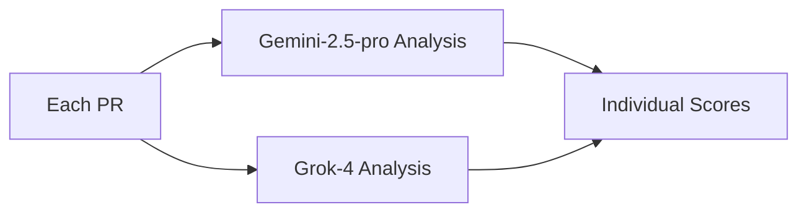

# WISH: PR Battle Royale - Multi-Agent Evaluation System

## 🎯 Objective
Create a comprehensive evaluation system to compare different coding agents and LLMs implementing the same structured tasks from the upstream migration, using consensus-based evaluation to determine winners and identify valuable features to absorb.

## 📊 Current State Analysis

### Foundation Task PRs Ready for Evaluation
1. **PR #7** - claude (migrate/upstream-foundation-b9b2) - OPEN
2. **PR #8/9** - cursor-cli-grok (forge-feat-found-a4a4) - CLOSED
3. **PR #6** - codex-medium (forge-feat-found-aafd) - OPEN
4. **PR #10** - opencode-code-supernova (forge-feat-found-21c8) - OPEN
5. **PR #12** - gemini (forge-feat-found-cf50) - OPEN
6. **PR #11** - opencode-kimi-k2 (forge-feat-found-3e6d) - OPEN

### Migration Tasks for Evaluation
1. **Foundation Setup** (6 PRs ready) - Upstream submodule and feature extraction
2. **Dual Frontend** (TODO) - Frontend migration with routing
3. **Build Validation** (TODO) - Build system and upstream sync testing

## 🏗️ Evaluation Framework

### Scoring Categories (100 points total)
```yaml
technical_implementation: 30%
  - Correctness of implementation
  - Code quality and standards
  - Performance considerations
  - Error handling

architecture_quality: 25%
  - Separation of concerns
  - Maintainability design
  - Scalability approach
  - Clean boundaries

safety_rollback: 20%
  - Data preservation
  - Rollback capability
  - Risk mitigation
  - Migration safety

documentation_clarity: 15%
  - Code documentation
  - README updates
  - Migration guides
  - Architecture decisions

innovation_extras: 10%
  - Creative solutions
  - Additional features
  - Performance optimizations
  - Developer experience
```

## 🤝 Consensus Workflow

### Phase 1: Individual Analysis


### Phase 2: Consensus Building
```typescript
interface ConsensusRound {
  round1: {
    type: "individual_scoring"
    llms: ["gemini-2.5-pro", "grok-4"]
    output: IndividualScores[]
  }

  round2: {
    type: "discussion"
    purpose: "Align on major differences"
    output: DiscussionNotes
  }

  round3: {
    type: "final_consensus"
    output: {
      winner: string
      scores: FinalScores
      features_to_absorb: Feature[]
    }
  }
}
```

### Phase 3: Final Review
```bash
# After consensus reached
codex exec "Review PR Battle Royale results and provide executive summary"
```

## 📊 Evaluation Sheet Schema

### CSV Format
```csv
Agent_LLM,PR_Number,Task,Tech_G,Tech_X,Tech_Consensus,Arch_G,Arch_X,Arch_Consensus,Safety_G,Safety_X,Safety_Consensus,Docs_G,Docs_X,Docs_Consensus,Innovation_G,Innovation_X,Innovation_Consensus,Total_LLM,Human1,Human2,Human3,Final_Score,Winner,Features_to_Absorb
claude,#7,foundation,85,82,84,90,88,89,85,87,86,80,78,79,75,80,77,85.1,,,,,false,"[]"
cursor-cli-grok,#8,foundation,80,83,82,85,82,84,90,92,91,75,77,76,85,87,86,85.8,,,,,false,"[worktree-cleanup]"
```

### JSON Schema
```json
{
  "evaluations": [{
    "agent": "claude",
    "pr_number": 7,
    "task": "foundation",
    "categories": {
      "technical": {
        "gemini": 85,
        "grok": 82,
        "consensus": 84,
        "weight": 0.30
      },
      "architecture": {
        "gemini": 90,
        "grok": 88,
        "consensus": 89,
        "weight": 0.25
      }
    },
    "total_llm_score": 85.1,
    "human_scores": {
      "evaluator1": null,
      "evaluator2": null,
      "evaluator3": null
    },
    "final_score": null,
    "is_winner": false,
    "features_to_absorb": []
  }]
}
```

## 🔧 Implementation Steps

### Step 1: Prepare Evaluation Data
```bash
# Checkout each PR branch for analysis
gh pr checkout 7  # claude
gh pr checkout 8  # cursor-cli-grok
gh pr checkout 6  # codex-medium
gh pr checkout 10 # opencode-code-supernova
gh pr checkout 12 # gemini
gh pr checkout 11 # opencode-kimi-k2
```

### Step 2: Run Consensus Evaluation
```typescript
// Using Zen consensus tool
const evaluateFoundation = async () => {
  const prs = [7, 8, 6, 10, 12, 11];

  for (const pr of prs) {
    // Round 1: Individual scoring
    const geminiScore = await agentMcp.chat({
      model: "gemini-2.5-pro",
      prompt: `Evaluate PR #${pr} against wish requirements...`
    });

    const grokScore = await agentMcp.chat({
      model: "grok-4",
      prompt: `Evaluate PR #${pr} against wish requirements...`
    });

    // Round 2: Consensus building
    const consensus = await agentMcp.consensus({
      models: ["gemini-2.5-pro", "grok-4"],
      scores: [geminiScore, grokScore],
      mode: "discussion"
    });

    // Store results
    saveEvaluation(pr, consensus);
  }
};
```

### Step 3: Determine Winner & Features
```typescript
interface WinnerSelection {
  criteria: {
    highest_total_score: number
    meets_all_requirements: boolean
    no_critical_issues: boolean
  }

  feature_absorption: {
    from_non_winners: Feature[]
    justification: string[]
  }
}
```

### Step 4: Human Validation
```yaml
human_evaluators:
  - evaluator1:
      role: "Technical Lead"
      focus: ["Architecture", "Code Quality"]
  - evaluator2:
      role: "DevOps Engineer"
      focus: ["Build System", "Safety"]
  - evaluator3:
      role: "Product Owner"
      focus: ["Requirements", "Documentation"]
```

### Step 5: Final Report Generation
```bash
# Generate comprehensive report
codex exec "
  Analyze PR Battle Royale results:
  - Winner justification
  - Features to absorb from non-winners
  - Lessons learned
  - Recommendations for next tasks
"
```

## ✅ Success Metrics
- All 6 PRs evaluated with consensus scores
- Winner selected with clear justification
- Valuable features identified from non-winners
- Human validation columns ready for input
- Executive summary generated
- Repeatable process for remaining tasks

## 🎯 Evaluation Questions for Each PR

### Technical Implementation (30%)
1. Does the submodule setup work correctly?
2. Are all forge features properly extracted?
3. Does the code compile without errors?
4. Are database migrations correct?

### Architecture Quality (25%)
1. Is upstream completely untouched?
2. Clear separation between forge and upstream?
3. Service composition patterns correct?
4. No circular dependencies?

### Safety & Rollback (20%)
1. Can we rollback if needed?
2. Data preservation handled?
3. Risk mitigation in place?
4. Migration path clear?

### Documentation (15%)
1. Code well-documented?
2. Migration steps clear?
3. Architecture decisions explained?
4. README updated?

### Innovation (10%)
1. Creative solutions used?
2. Performance improvements?
3. Developer experience enhanced?
4. Extra helpful features?

## 📈 Next Steps After Foundation

### Task 2: Dual Frontend Evaluation
- Same evaluation framework
- Focus on UI/UX preservation
- Frontend performance metrics
- User experience consistency

### Task 3: Build Validation Evaluation
- Build time comparison
- Upstream sync success
- CI/CD integration
- NPM package functionality

## 🚦 Execution Checklist

### Pre-Evaluation
- [x] Document all PR numbers and branches
- [x] Define evaluation categories and weights
- [x] Create consensus workflow
- [x] Design evaluation schema
- [ ] Set up Zen consensus tools

### During Evaluation
- [ ] Run individual LLM evaluations
- [ ] Conduct consensus rounds
- [ ] Document discussions
- [ ] Identify standout features
- [ ] Calculate weighted scores

### Post-Evaluation
- [ ] Select winner with justification
- [ ] List features to absorb
- [ ] Prepare for human validation
- [ ] Generate executive summary
- [ ] Create recommendations for next tasks

## 📝 Notes on Fairness

- Each implementation evaluated against same wish requirements
- Consistent scoring rubric across all PRs
- Multiple LLMs to reduce bias
- Human validation as final check
- Focus on objective metrics

---

*This evaluation system ensures fair, comprehensive comparison of all agent implementations with clear winner selection and feature absorption strategy.*