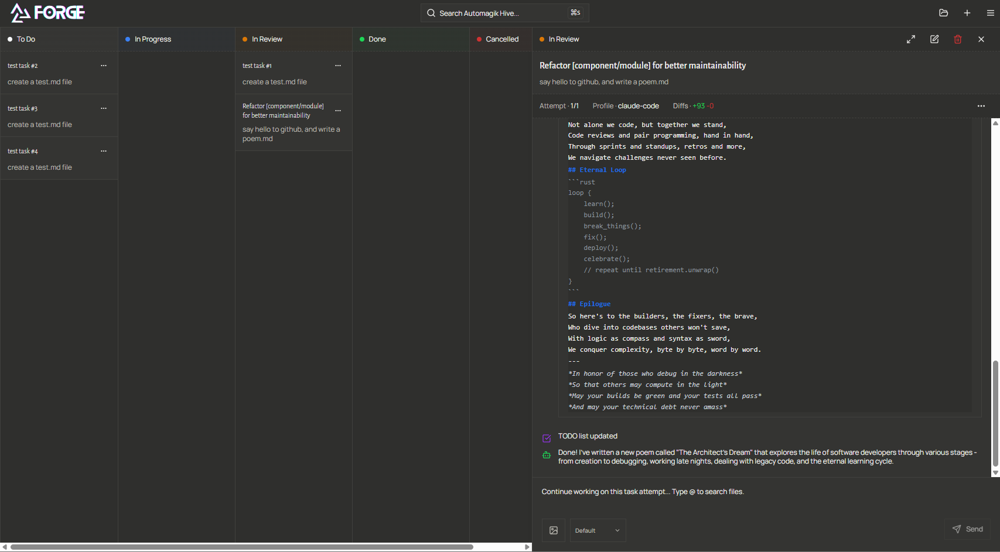

<p align="center">
  <a href="https://forge.automag.ik">
    
  </a>
</p>
<h2 align="center">The Vibe Coding++™ Platform for Human-AI Development</h2>

<p align="center">
  <strong>🎯 Where Vibe Coding Meets Structured Execution</strong><br>
  Works with any AI coding tool through natural language, execute in isolated environments,<br>
  ship confident code with complete control and visibility
</p>

<p align="center">
  <a href="https://www.npmjs.com/package/automagik-forge"></a>
  <a href="https://github.com/namastexlabs/automagik-forge/actions"></a>
  <a href="https://github.com/namastexlabs/automagik-forge/blob/main/LICENSE"></a>
  <a href="https://discord.gg/xcW8c7fF3R"></a>
  <a href="https://github.com/orgs/namastexlabs/projects/9/views/1?filterQuery=project%3Aforge"></a>
</p>

<p align="center">
  <a href="#-key-features">Features</a> •
  <a href="#-quick-start">Quick Start</a> •
  <a href="https://github.com/orgs/namastexlabs/projects/9/views/1?filterQuery=project%3Aforge">Roadmap</a> •
  <a href="#-development">Development</a> •
  <a href="#-contributing">Contributing</a>
</p>



---

## 🚀 What is Automagik Forge?

**Automagik Forge** is the vibe coding++ platform where humans stay in control. It's the structured home for your AI development tasks - plan them yourself or vibe with AI to create them, experiment with different agents to find what works, review everything before shipping. No more code that breaks in 2 weeks.

### 🎭 Vibe Coding++™ Philosophy

**Regular vibe coding problem**: You chat with AI, get code, ship it. Two weeks later? Everything breaks and you can't fix it because you let AI do everything.

**Vibe Coding++™ solution**: Perfect human-AI integration where you:

- 📋 **You Plan Tasks**: Break down work yourself or use AI to help plan
- 🏠 **Forge is Home**: All tasks live in persistent kanban, not lost in chat history or random .md files scattered across your codebase
- 🧪 **You Experiment**: Try different agents on same task - see what works best
- 🎯 **You Choose Agents**: Pick which coding agent AND specialized agent for each task
- 🔒 **Isolated Attempts**: Each attempt in its own Git worktree - no conflicts
- 👀 **You Review**: Understand what changed before merging
- 🚀 **Ship Confident Code**: Code that won't mysteriously break in 2 weeks

### 🚫 Why Regular Vibe Coding Fails

The "just let AI do it" approach creates a ticking time bomb:
- **No Structure**: Random chat conversations, no task tracking
- **No Control**: AI makes all decisions, you don't understand the code
- **No Memory**: What did we build last week? Who knows! Lost in chat history or random .md files
- **No Experimentation**: Stuck with one agent's approach
- **The 2-Week Curse**: Code works today, breaks tomorrow, unfixable forever

### ✅ The Vibe Coding++™ Solution

Forge elevates human potential - you orchestrate, AI executes:
- **You Own the Kanban**: Tasks you create, not AI's whims
- **You Pick the Agent**: Try Claude, then Gemini, see what works
- **You Choose Specialization**: Apply "test writer" or "PR reviewer" as needed
- **Multiple Attempts**: Each task can have multiple attempts with different agents
- **Git Worktree Isolation**: Every attempt isolated, no conflicts
- **You Review & Understand**: Know exactly what's changing before merge
- **MCP Control**: Create/update tasks from your coding agent without leaving your flow

---

## 🌟 Key Features

- **8 AI Coding Agents**: Claude, Cursor CLI, Gemini, Codex, and more - including open-source options
- **Specialized Agents**: Custom prompts that work with ANY coding agent (test-writer, pr-reviewer, etc.)
- **Multiple Attempts Per Task**: Try different agents, compare results, choose the best
- **Parallel Execution**: Run multiple agents simultaneously on different tasks
- **Git Worktree Isolation**: Every attempt in its own isolated environment
- **Persistent Kanban Board**: Tasks live forever, not lost in chat history
- **Task Templates**: Reusable patterns for common workflows
- **MCP Server Built-in**: Control from any AI coding agent without leaving your flow
- **Visual Context**: Attach screenshots and diagrams to tasks
- **Real-time Progress**: Watch agents work, see diffs as they happen
- **GitHub Integration**: OAuth authentication and repository management
- **100% Open Source**: Free forever, self-hostable, no vendor lock-in

---

## 🤖 Two Types of Agents, Clear and Simple

> **The Key Distinction:**
> - **AI Coding Agents** = The AI execution platforms (CLI tools that run AI models)
> - **Specialized Agents** = Custom prompts that work with ANY coding agent
> - Example: Your "test-writer" specialized agent can run on Claude today, Gemini tomorrow

### 🛠️ AI Coding Agents Available in Forge

Forge can execute tasks using these AI coding agents - including open-source and LLM-agnostic options:

- **Claude Code** - Anthropic's Claude models
- **Claude Code Router** - LLM-agnostic, use ANY model instead of Claude
- **Cursor CLI** - Cursor's CLI agent (separate from their IDE)
- **Gemini** - Google's Gemini models
- **Codex** - OpenAI's code models
- **Amp** - Sourcegraph's code intelligence
- **OpenCode** - Open-source models, fully local execution
- **Qwen Code** - Alibaba's open-source models

**The Power:** Not locked to subscriptions - use open-source models, route to any LLM, or bring your own API keys

### 🧪 Task Attempts: Experiment Until It Works

Each task can have multiple attempts - try different approaches:

```yaml
Task: "Implement user authentication"
├── Attempt 1: Claude + "security-expert" → Too complex
├── Attempt 2: Gemini + default → Missing edge cases  
├── Attempt 3: Cursor + "auth-specialist" → Perfect! ✅
└── Result: You choose Attempt 3 to merge
```

**The Power of Attempts:**
- Each attempt runs in isolated Git worktree
- Compare different agent outputs side-by-side
- No commits until YOU approve
- Learn which agent works best for which task type

**Available Templates:**
- 🔍 **Code Review**: Multi-agent PR analysis
- 🐛 **Bug Hunt**: Reproduce → Fix → Test → Document
- ✨ **Feature Dev**: Design → Implement → Test → Deploy
- 🔧 **Refactor**: Analyze → Plan → Execute → Verify
- 📚 **Documentation**: Code → Comments → README → Examples

---

## 📡 MCP: Remote Control from Anywhere

Automagik Forge acts as a **Model Context Protocol (MCP) server**, enabling AI coding agents to programmatically manage tasks. Control your Forge task board from your preferred AI coding agent without leaving your flow.

### Typical Workflow

1. **Planning Phase**: Use your AI agent to help brainstorm and plan tasks
2. **Task Creation**: You (or your agent) creates task cards via MCP
3. **Bug Discovery**: Find issues while coding? Add them to the backlog via MCP
4. **Status Updates**: Update task progress as work completes
5. **Cross-Agent Access**: Any MCP-compatible agent can access your task board

### Example Use Cases

- 🎯 **"Help me plan a complete authentication system with OAuth, JWT, and role-based access"** → You create epic with subtasks
- 🐛 **"Add bug: API returns 500 on malformed JSON input in /api/users endpoint"** → Create detailed bug card via MCP
- ✅ **"Mark all database migration tasks as complete and move API tasks to in-progress"** → Batch update statuses via MCP
- 📋 **"Show me all high-priority tasks that are blocked or have dependencies"** → Query tasks with filters via MCP

### Available MCP Tools

| Tool | Description | Example Usage |
|------|-------------|---------------|
| `list_projects` | Get all projects | "List all my active projects" |
| `list_tasks` | View tasks with filters | "Show pending backend tasks" |
| `create_task` | Add new task to project | "Create task: Implement Redis caching layer" |
| `get_task` | Get detailed task info | "Show details for task-abc123" |
| `update_task` | Modify task properties | "Move task-xyz to in-review" |
| `delete_task` | Remove completed/obsolete tasks | "Delete all cancelled tasks" |

### Quick Setup

<details>
<summary><b>Getting Your Project ID</b></summary>

1. Run `npx automagik-forge` to open the UI
2. Create or select your project
3. The Project ID (UUID) appears in:
   - The browser URL: `http://localhost:3000/projects/{PROJECT_ID}/tasks`
   - The project settings panel
   - Example: `a1b2c3d4-e5f6-7890-abcd-ef1234567890`

</details>

<details>
<summary><b>🤖 Claude Code Configuration</b></summary>

1. Open Claude Code settings
2. Navigate to MCP Servers section
3. Add Forge server configuration:

**Basic Mode** (Core task management tools only):
```json
{
  "mcpServers": {
    "automagik-forge": {
      "command": "npx",
      "args": ["automagik-forge", "--mcp"],
      "env": {
        "PROJECT_ID": "your-project-uuid-here"
      }
    }
  }
}
```

**Advanced Mode** (Full backend API access with 49+ tools):
```json
{
  "mcpServers": {
    "automagik-forge": {
      "command": "npx",
      "args": ["automagik-forge", "--mcp-advanced"],
      "env": {
        "PROJECT_ID": "your-project-uuid-here"
      }
    }
  }
}
```

4. Restart Claude Code
5. Use natural language: "Create tasks for implementing a real-time chat feature"

**Choose Your Mode:**
- `--mcp`: Core 7 tools for task management (list_projects, list_tasks, create_task, etc.)
- `--mcp-advanced`: All 56 tools including projects, task attempts, processes, drafts, containers, filesystem, and Omni integration

</details>

<details>
<summary><b>🎯 Cursor Configuration</b></summary>

1. Open Cursor Settings (`Cmd/Ctrl + ,`)
2. Search for "MCP" in settings
3. Add to MCP configuration:

**Basic Mode** (Core task management tools only):
```json
{
  "mcp.servers": {
    "automagik-forge": {
      "command": "npx",
      "args": ["automagik-forge", "--mcp"],
      "projectId": "your-project-uuid-here"
    }
  }
}
```

**Advanced Mode** (Full backend API access with 49+ tools):
```json
{
  "mcp.servers": {
    "automagik-forge": {
      "command": "npx",
      "args": ["automagik-forge", "--mcp-advanced"],
      "projectId": "your-project-uuid-here"
    }
  }
}
```

4. Reload window (`Cmd/Ctrl + R`)
5. Tasks are now accessible via `@automagik-forge`

</details>

<details>
<summary><b>📝 VSCode + Cline Configuration</b></summary>

**For Cline Extension:**
1. Install Cline from VSCode marketplace
2. Open Cline settings (`Cmd/Ctrl + Shift + P` → "Cline: Settings")
3. Add MCP server:

```json
{
  "cline.mcpServers": [
    {
      "name": "automagik-forge",
      "command": "npx",
      "args": ["automagik-forge", "mcp-server"],
      "env": {
        "PROJECT_ID": "your-project-uuid-here"
      }
    }
  ]
}
```

4. Restart VSCode
5. Cline can now manage tasks directly

</details>

<details>
<summary><b>🚀 Roo Code Configuration</b></summary>

1. Open Roo Code preferences
2. Navigate to Extensions → MCP
3. Add new server:

```yaml
servers:
  automagik-forge:
    command: npx
    args: 
      - automagik-forge
      - mcp-server
    environment:
      PROJECT_ID: your-project-uuid-here
```

4. Save and restart Roo Code
5. Access via command palette: "Roo: Create Task"

</details>

<details>
<summary><b>💎 Gemini CLI Configuration</b></summary>

1. Edit Gemini CLI config file (`~/.gemini/config.json`)
2. Add MCP server entry:

```json
{
  "mcp": {
    "servers": {
      "automagik-forge": {
        "type": "stdio",
        "command": "npx",
        "args": ["automagik-forge", "mcp-server"],
        "env": {
          "PROJECT_ID": "your-project-uuid-here"
        }
      }
    }
  }
}
```

3. Run: `gemini reload-config`
4. Use: `gemini task create "Implement user dashboard with charts"`

</details>

<details>
<summary><b>🔧 Generic MCP Configuration</b></summary>

For any MCP-compatible tool, use this standard configuration:

```json
{
  "command": "npx",
  "args": ["automagik-forge", "mcp-server"],
  "env": {
    "PROJECT_ID": "your-project-uuid-here"
  }
}
```

**Tool-Specific Paths:**
- Check your tool's MCP or extensions documentation
- Look for "MCP Servers", "External Tools", or "Model Context Protocol" settings
- The configuration format is typically JSON or YAML

</details>

---

## 🎭 Vibe Coding++™ Workflows

### Human Orchestration, Not AI Automation


### Example: Building a Feature
```bash
You: "I need a user dashboard with charts and real-time updates"

Your Process:
1. YOU create tasks (or use AI to help plan):
   ├── Task 1: Design dashboard layout
   ├── Task 2: Create chart components  
   ├── Task 3: Build WebSocket service
   ├── Task 4: Write integration tests
   └── Task 5: Generate documentation

2. YOU experiment with different agents:
   Task 2 - Chart Components:
   ├── Attempt 1: Try Claude → Too abstract
   ├── Attempt 2: Try Cursor → Good but verbose
   └── Attempt 3: Try Gemini → Perfect! ✅
   
3. YOU review and choose what to merge

The Power: You're in control, not hoping AI gets it right
```

---

## 📊 Vibe Coding vs Vibe Coding++™

| Feature | Forge (Vibe Coding++™) | Lovable (Regular Vibe Coding) |
|---------|----------------------|-------------------------------|
| **Human Control** | ✅ You orchestrate every decision | ❌ AI acts autonomously |
| **Task Persistence** | ✅ Kanban board - tasks live forever | ❌ Lost in chat conversations |
| **Multiple Attempts** | ✅ Try different agents per task | ❌ One AI, one approach |
| **8 AI Coding Agents** | ✅ Claude, Cursor CLI, Gemini, etc. | ❌ Single AI model |
| **Specialized Agents** | ✅ Custom prompts for any agent | ❌ Fixed behavior |
| **Git Worktree Isolation** | ✅ Every attempt isolated | ❌ Direct code changes |
| **MCP Server** | ✅ 6 tools for remote control | ❌ No external integration |
| **2-Week Curse Protection** | ✅ You understand the code | ❌ AI black box magic |
| **Code Review** | ✅ Review before merge | ❌ Auto-applies changes |
| **Visual Context** | ✅ Attach screenshots to tasks | ✅ Can generate images |
| **Open Source** | ✅ 100% open-source | ❌ Proprietary |
| **Pricing Model** | ✅ Free forever | 💰 Usage-based credits |
| **Self-Hostable** | ✅ Your infrastructure | ❌ Cloud-only |

---

## 📦 Quick Start

### Prerequisites

- Node.js 18+ and pnpm 8+
- Authenticated AI coding agent (Claude Code, Gemini CLI, etc.)
- Git repository to work with

### Installation

```bash
# Install globally
npm install -g automagik-forge

# Or run directly with npx
npx automagik-forge
```

### First Run

```bash
# Navigate to your project
cd your-project

# Launch Forge
automagik-forge

# Open browser to http://localhost:3000
```

---

## 🛠️ Development

Interested in contributing or building from source? Check out our [Developer Guide](DEVELOPER.md) for detailed instructions on:
- Setting up the development environment
- Building from source
- Running tests
- Database migrations
- Architecture details

### Upstream Management

Automagik Forge uses a mechanical rebranding approach to stay in sync with the upstream vibe-kanban template:

**Architecture:**
- `upstream/` - Git submodule pointing to namastexlabs/vibe-kanban fork
- `namastexlabs/vibe-kanban` - Fork that mirrors BloopAI/vibe-kanban
- `scripts/rebrand.sh` - Converts all vibe-kanban references to automagik-forge
- `forge-extensions/` - Real features (omni, config, branch templates)
- Minimal `forge-overrides/` - Only feature files, no branding

**Complete Workflow:** Sync fork → Create namastex tag → Update gitmodule → Rebrand → Verify & commit

#### Updating to New Version

**Automated (recommended):**
```bash
# From automagik-forge repo
mcp__genie__run agent="utilities/upstream-update" prompt="Update to v0.0.106"
```

**Manual:**
```bash
# 1. Sync fork (in namastexlabs/vibe-kanban repo)
git remote add upstream https://github.com/BloopAI/vibe-kanban.git
git fetch upstream --tags
LATEST_TAG=$(git tag --list 'v0.0.*' --sort=-version:refname | head -1)
git reset --hard upstream/main
git push origin main --force

# 2. Create namastex release tag
NAMASTEX_TAG="${LATEST_TAG%-*}-namastex"
git tag -a $NAMASTEX_TAG -m "Namastex release based on $LATEST_TAG"
git push origin $NAMASTEX_TAG
gh release create $NAMASTEX_TAG --repo namastexlabs/vibe-kanban --title "$NAMASTEX_TAG" --notes "Based on $LATEST_TAG"

# 3. Update gitmodule (in automagik-forge repo)
cd upstream
git fetch origin --tags
git checkout $NAMASTEX_TAG
cd ..

# 4. Apply mechanical rebrand
./scripts/rebrand.sh

# 5. Verify success
grep -r "vibe-kanban" upstream frontend | wc -l  # Must be 0
cargo check --workspace
cd frontend && pnpm run check

# 6. Commit changes
git add -A
git commit -m "chore: update upstream to $NAMASTEX_TAG and rebrand"
```

**Total time:** ~3-5 minutes. Full automation via agent!

---

## 🗺️ Roadmap

### Completed ✅
- [x] Multi-agent orchestration
- [x] Kanban task management
- [x] Git worktree isolation
- [x] MCP server implementation
- [x] Real-time progress streaming

### Next Up 🚀
- [ ] **Wish System & Genie** - Natural language wishes become epics with subtasks, interactive AI assistant navigates the UI
- [ ] **Bilateral sync** - Two-way sync with GitHub Issues, Jira, Notion, Linear
- [ ] **Epics & Subtasks** - Hierarchical task organization with dependency management
- [ ] Agent performance analytics
- [ ] Team collaboration features
- [ ] Community templates
- [ ] Integration with CI/CD pipelines

---

## 🤝 Contributing

We love contributions! However, to maintain project coherence:

1. **Discuss First**: Open an issue before starting work
2. **Align with Roadmap**: Ensure changes fit our vision
3. **Follow Standards**: Match existing code patterns
4. **Test Thoroughly**: Include tests for new features
5. **Document Well**: Update docs with your changes

See [CONTRIBUTING.md](CONTRIBUTING.md) for detailed guidelines.
---

## 🙏 Acknowledgments

Special thanks to:
- Vibe Kanban team, whose original vision inspired Automagik Forge's evolution.
- All our early adopters and contributors

---

## 📄 License

MIT License - see [LICENSE](LICENSE) file for details.

---

## 🔗 Links

- **Website**: [forge.automag.ik](https://forge.automag.ik)
- **NPM Package**: [npmjs.com/package/automagik-forge](https://www.npmjs.com/package/automagik-forge)
- **GitHub**: [github.com/namastexlabs/automagik-forge](https://github.com/namastexlabs/automagik-forge)
- **Discord**: [discord.gg/xcW8c7fF3R](https://discord.gg/xcW8c7fF3R)
- **Twitter**: [@namastexlabs](https://twitter.com/namastexlabs)

---

<p align="center">
  <strong>🚀 Stop the 2-week curse. Start shipping code you actually understand.</strong><br>
  <strong>Vibe Coding++™ - Where Human Control Meets AI Power</strong><br><br>
  <a href="https://github.com/namastexlabs/automagik-forge">Star us on GitHub</a> •
  <a href="https://discord.gg/xcW8c7fF3R">Join our Discord</a> •
</p>

<p align="center">
  Made with ❤️ by <a href="https://namastex.ai">Namastex Labs</a><br>
  <em>AI that elevates human potential, not replaces it</em>
</p>
<a href="https://deepwiki.com/namastexlabs/automagik-forge"></a>
