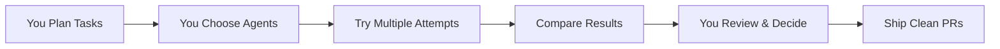

# Automagik Forge README Enhancement Plan

## 🎯 Strategic Vision: "Vibe Coding++™" Positioning

### Core Concept
Position Automagik Forge as the **"Vibe Coding++™ Platform"** - where casual AI vibing transforms into structured, maintainable code through human-controlled orchestration.

### Selected Positioning
**"Open-source vibe coding platform where humans orchestrate AI pair programming. Create kanban tasks, experiment with different agents, execute in isolated Git worktrees, and ship code that won't break in 2 weeks."**

### The Problem with Regular Vibe Coding
Regular vibe coding gets you started fast, but the code breaks 2 weeks later. Why? No structure, no control - you just let AI do everything and hope for the best.

### Clear Terminology
- **AI Coding Agents**: The actual AI services Forge can execute (Claude, Cursor, Gemini, etc.) - CLI tools that run AI models
- **Specialized Agents**: Custom prompt configurations (Test Writer, PR Reviewer, etc.) that work with ANY coding agent
- **Vibe Coding++™**: Human-controlled orchestration where YOU choose agents and approaches for each task

---

## 📝 Unified Messaging Framework

### Primary Tagline
> **"Vibe Coding++™ : Where Human Control Meets AI Power"**

### Key Messages
1. **Human Orchestration**: You plan tasks, choose agents, review results
2. **Vibe Coding++™**: Elevate from "let AI do it" to "I control AI"
3. **No More 2-Week Curse**: Ship code that stays maintainable
4. **Experiment Freely**: Try different agents on same task - find what works
5. **Specialized Agents**: Create custom prompts that work with ANY platform
6. **MCP Integration**: Control your task board from any AI coding agent
7. **Structured Home**: Tasks live in kanban, not lost in chat history

### SEO Keywords
- vibe coding
- AI pair programming
- human-AI collaboration
- MCP server
- task orchestration
- agent-agnostic
- Git worktree isolation
- kanban for AI

---

## 🚀 README Enhancement Implementation

### Phase 1: Core Messaging Update (Immediate)

#### 1.1 New Header Section (Lines 7-12)
```markdown
<h1 align="center">Automagik Forge</h1>
<h2 align="center">The Vibe Coding++™ Platform for Human-AI Development</h2>

<p align="center">
  <strong>🎯 Where Vibe Coding Meets Structured Execution</strong><br>
  Works with any AI coding tool through natural language, execute in isolated environments,<br>
  ship confident code with complete control and visibility
</p>
```

#### 1.2 Updated Introduction (Line 33+)
```markdown
## 🚀 What is Automagik Forge?

**Automagik Forge** is the vibe coding++ platform where humans stay in control. It's the structured home for your AI development tasks - plan them yourself or vibe with AI to create them, experiment with different agents to find what works, review everything before shipping. No more code that breaks in 2 weeks.

### 🎭 Vibe Coding++™ Philosophy

**Regular vibe coding problem**: You chat with AI, get code, ship it. Two weeks later? Everything breaks and you can't fix it because you let AI do everything.

**Vibe Coding++™ solution**: Perfect human-AI integration where you:

- 📋 **You Plan Tasks**: Break down work yourself or use AI to help plan
- 🏠 **Forge is Home**: All tasks live in persistent kanban, not lost in chat history or random .md files scattered across your codebase
- 🧪 **You Experiment**: Try different agents on same task - see what works best
- 🎯 **You Choose Agents**: Pick which coding agent AND specialized agent for each task
- 🔒 **Isolated Attempts**: Each attempt in its own Git worktree - no conflicts
- 👀 **You Review**: Understand what changed before merging
- 🚀 **Ship Confident Code**: Code that won't mysteriously break in 2 weeks
```

#### 1.3 Problem/Solution Reframe (Lines 39-54)
```markdown
### 🚫 Why Regular Vibe Coding Fails

The "just let AI do it" approach creates a ticking time bomb:
- **No Structure**: Random chat conversations, no task tracking
- **No Control**: AI makes all decisions, you don't understand the code
- **No Memory**: What did we build last week? Who knows! Lost in chat history or random .md files
- **No Experimentation**: Stuck with one agent's approach
- **The 2-Week Curse**: Code works today, breaks tomorrow, unfixable forever

### ✅ The Vibe Coding++™ Solution

Forge elevates human potential - you orchestrate, AI executes:
- **You Own the Kanban**: Tasks you create, not AI's whims
- **You Pick the Agent**: Try Claude, then Gemini, see what works
- **You Choose Specialization**: Apply "test writer" or "PR reviewer" as needed
- **Multiple Attempts**: Each task can have multiple attempts with different agents
- **Git Worktree Isolation**: Every attempt isolated, no conflicts
- **You Review & Understand**: Know exactly what's changing before merge
- **MCP Control**: Create/update tasks from your coding agent without leaving your flow
```

---

### Phase 2: Feature Enhancement 

#### 2.1 AI Coding Agents & Specialized Agents (After line 60)
```markdown
### 🤖 **Two Types of Agents, Clear and Simple**

> **The Key Distinction:**
> - **AI Coding Agents** = The AI execution platforms (CLI tools that run AI models)
> - **Specialized Agents** = Custom prompts that work with ANY coding agent
> - Example: Your "test-writer" specialized agent can run on Claude today, Gemini tomorrow

### 🛠️ **AI Coding Agents Available in Forge**

Forge can execute tasks using these AI coding agents - including open-source and LLM-agnostic options:

- **Claude Code** - Anthropic's Claude models
- **Claude Code Router** - LLM-agnostic, use ANY model instead of Claude
- **Cursor CLI** - Cursor's CLI agent (separate from their IDE)
- **Gemini** - Google's Gemini models
- **Codex** - OpenAI's code models
- **Amp** - Sourcegraph's code intelligence
- **OpenCode** - Open-source models, fully local execution
- **Qwen Code** - Alibaba's open-source models

**The Power:** Not locked to subscriptions - use open-source models, route to any LLM, or bring your own API keys

### 🧪 **Task Attempts: Experiment Until It Works**

Each task can have multiple attempts - try different approaches:

```yaml
Task: "Implement user authentication"
├── Attempt 1: Claude + "security-expert" → Too complex
├── Attempt 2: Gemini + default → Missing edge cases  
├── Attempt 3: Cursor + "auth-specialist" → Perfect! ✅
└── Result: You choose Attempt 3 to merge
```

**The Power of Attempts:**
- Each attempt runs in isolated Git worktree
- Compare different agent outputs side-by-side
- No commits until YOU approve
- Learn which agent works best for which task type

### 🎯 **Specialized Agents: Your Custom Experts**

Create specialized agents that enhance ANY coding agent:

```yaml
# These work with ANY AI coding agent above
specialized_agents:
  - name: "test-writer"
    prompt: "You are an expert at writing comprehensive tests. Always include edge cases..."
    # Can run on: Claude, Gemini, Cursor, or any other agent
    
  - name: "pr-reviewer" 
    prompt: "Review code for security vulnerabilities, performance issues, and patterns..."
    # Can run on: Claude, Gemini, Cursor, or any other agent
    
  - name: "automagik-forge-expert"
    prompt: "You specialize in the Automagik Forge codebase. You know..."
    # Can run on: Claude, Gemini, Cursor, or any other agent
```

### 📡 **MCP: Remote Control from Anywhere**

Use MCP to control Forge from your preferred AI coding agent:
- Create tasks from Claude Code without switching to Forge UI
- Let Cursor add bugs to your backlog while you code
- Have Gemini update task statuses as work completes

**The Power of Separation:**
- **Choose your AI coding agent** based on your subscription
- **Apply specialized agents** based on the task needs
- **Result**: Right expertise on right platform for each task
```

#### 2.2 Task Templates Section (After line 70)
```markdown
### 📋 **Vibe Coding Templates**

Pre-built workflows for common development patterns:

```yaml
# Example: Code Review Template
name: "PR Review Workflow"
steps:
  - agent: claude
    task: "Review code architecture and patterns"
  - agent: gemini  
    task: "Check for security vulnerabilities"
  - agent: cursor
    task: "Suggest performance optimizations"
  - human: "Final review and merge decision"
```

**Available Templates:**
- 🔍 **Code Review**: Multi-agent PR analysis
- 🐛 **Bug Hunt**: Reproduce → Fix → Test → Document
- ✨ **Feature Dev**: Design → Implement → Test → Deploy
- 🔧 **Refactor**: Analyze → Plan → Execute → Verify
- 📚 **Documentation**: Code → Comments → README → Examples
```

#### 2.3 Visual Documentation (New Section)
```markdown
### 📸 **Visual Context**

Attach screenshots, diagrams, or mockups to any task - agents see the visual context and generate better solutions.
```

---

### Phase 3: Advanced Features 

#### 3.1 Vibe Coding Workflows Section
```markdown
## 🎭 Vibe Coding++™ Workflows

### Human Orchestration, Not AI Automation



### Example: Building a Feature
```bash
You: "I need a user dashboard with charts and real-time updates"

Your Process:
1. YOU create tasks (or use AI to help plan):
   ├── Task 1: Design dashboard layout
   ├── Task 2: Create chart components  
   ├── Task 3: Build WebSocket service
   ├── Task 4: Write integration tests
   └── Task 5: Generate documentation

2. YOU experiment with different agents:
   Task 2 - Chart Components:
   ├── Attempt 1: Try Claude → Too abstract
   ├── Attempt 2: Try Cursor → Good but verbose
   └── Attempt 3: Try Gemini → Perfect! ✅
   
3. YOU review and choose what to merge

The Power: You're in control, not hoping AI gets it right
```
```

#### 3.2 Comparison Matrix
```markdown
## 📊 Vibe Coding vs Vibe Coding++™

| Feature | Forge (Vibe Coding++™) | Lovable (Regular Vibe Coding) |
|---------|----------------------|-------------------------------|
| **Human Control** | ✅ You orchestrate every decision | ❌ AI acts autonomously |
| **Task Persistence** | ✅ Kanban board - tasks live forever | ❌ Lost in chat conversations |
| **Multiple Attempts** | ✅ Try different agents per task | ❌ One AI, one approach |
| **8 AI Coding Agents** | ✅ Claude, Cursor CLI, Gemini, etc. | ❌ Single AI model |
| **Specialized Agents** | ✅ Custom prompts for any agent | ❌ Fixed behavior |
| **Git Worktree Isolation** | ✅ Every attempt isolated | ❌ Direct code changes |
| **MCP Server** | ✅ 6 tools for remote control | ❌ No external integration |
| **2-Week Curse Protection** | ✅ You understand the code | ❌ AI black box magic |
| **Code Review** | ✅ Review before merge | ❌ Auto-applies changes |
| **Visual Context** | ✅ Attach screenshots to tasks | ✅ Can generate images |
| **Pricing Model** | ✅ Free & open-source | 💰 Usage-based credits |
| **Self-Hostable** | ✅ Your infrastructure | ❌ Cloud-only |
```

---

## 📋 Implementation Checklist

### Immediate Actions (Day 1)
- [x] Update main tagline to "Vibe Coding++™ Platform"
- [x] Rewrite introduction with vibe coding philosophy
- [x] List all 8 AI coding agents Forge can execute
- [x] Explain specialized agents work with ANY coding agent
- [x] Add clear terminology box distinguishing the two types
- [x] Add task templates section with examples
- [x] Create visual documentation section
- [x] Update all examples to use vibe coding language
- [x] Add vibe coding workflows section
- [x] Create comprehensive comparison matrix
- [ ] Add animated GIF showing vibe coding in action
- [ ] Update all documentation to use unified messaging

### Success Metrics
- [x] README clearly positions as "Vibe Coding++™ platform"
- [x] All 8 AI coding agents are clearly listed
- [x] Specialized agents concept is explained as platform-agnostic
- [x] Clear distinction between coding agents vs specialized agents
- [x] Visual documentation capability is highlighted
- [x] MCP server is positioned for remote control
- [x] Human orchestration philosophy is clear throughout

---

## 🎨 Visual Assets Needed

1. **Hero Image**: Dashboard showing vibe coding in action
2. **Architecture Diagram**: Updated to show vibe coding flow
3. **Agent Logos**: Icons for all 8 supported agents
4. **Workflow GIF**: Animated demo of task creation → execution → PR
5. **Before/After**: Comparison showing chaos vs. structured vibe coding

---

## 📣 Marketing Alignment

### Social Media Positioning
"Automagik Forge: The open-source Vibe Coding++™ platform where humans orchestrate AI agents. You plan, you choose, you review. Ship code that won't break in 2 weeks. 🚀"

### GitHub Description
"Open-source vibe coding platform for orchestrating AI pair programming with kanban tasks, Git isolation, and MCP server built-in"

### NPM Package Description  
"Vibe coding orchestrator for human-AI development. You create tasks, choose agents, experiment with approaches, ship code you understand."

---

## 🚦 Review Criteria

Before publishing, ensure:

1. **Vibe Coding++™** appears prominently (10+ mentions)
2. **8 AI coding agents** are listed (Claude, Cursor CLI, Gemini, etc.)
3. **Specialized agents** are explained as platform-agnostic custom prompts
4. **Clear distinction** between coding agents (platforms) vs specialized agents (prompts)
5. **MCP Server** section explains remote task management
6. **Visual documentation** capability is highlighted
7. **Human orchestration** philosophy is clear throughout
8. **Comparison table** shows unique differentiators
9. **Examples** use natural, conversational language
10. **SEO keywords** are naturally integrated

---

## 📅 Timeline

- **Day 1**: Core messaging updates
- **Day 2-3**: Feature sections enhancement  
- **Day 4-5**: Advanced sections and visuals
- **Day 6**: Review and polish
- **Day 7**: Publish and announce

---

## 🎯 Success Statement

When complete, the README will position Automagik Forge as **THE Vibe Coding++™ platform** - where humans stay in control while orchestrating AI agents to build maintainable code that won't break in 2 weeks.

The key differentiator: **"Vibe Coding++™ elevates human potential - you plan, you choose, you review. AI executes. No more letting AI do everything and hoping for the best."**

Core message: **Stop the 2-week curse. Start shipping code you actually understand.**
